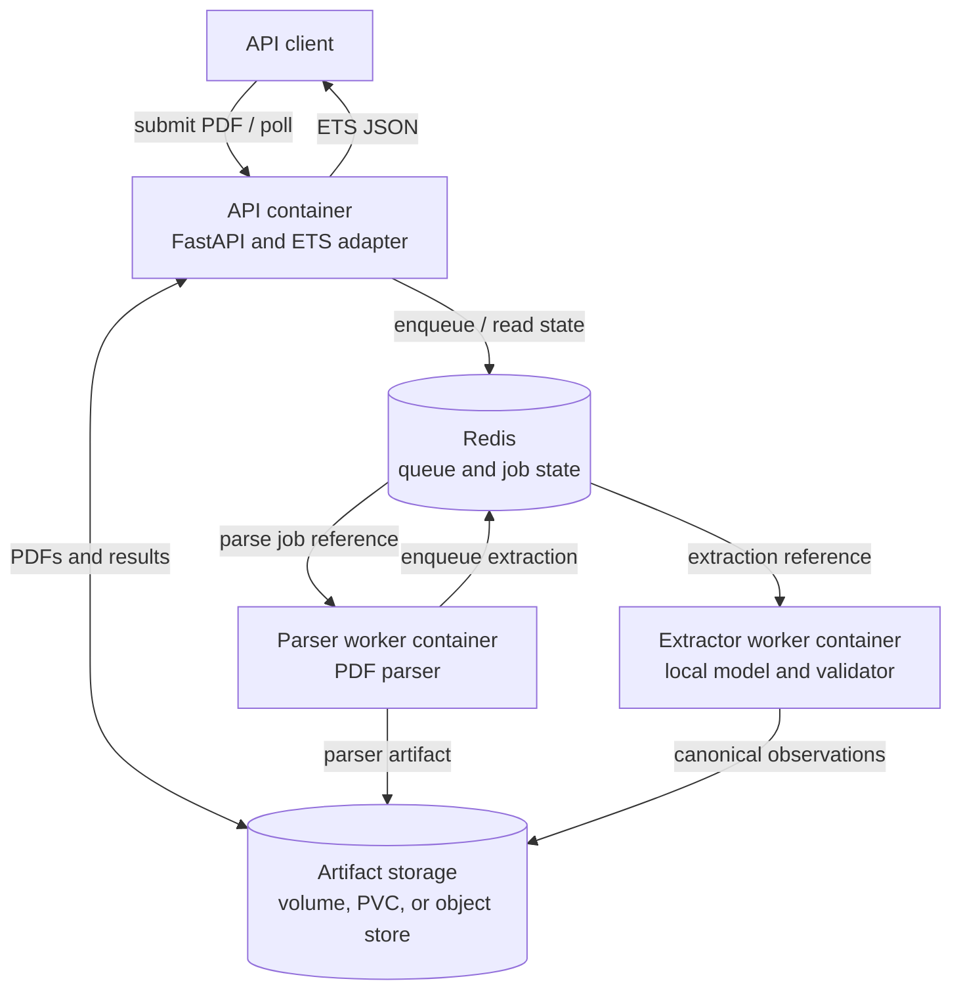
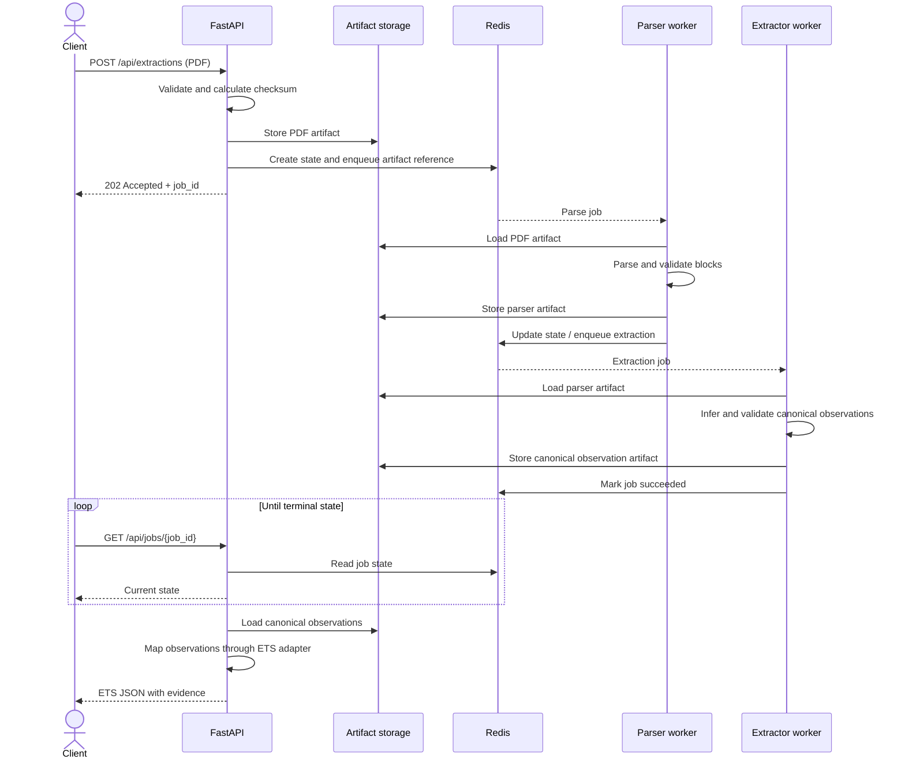
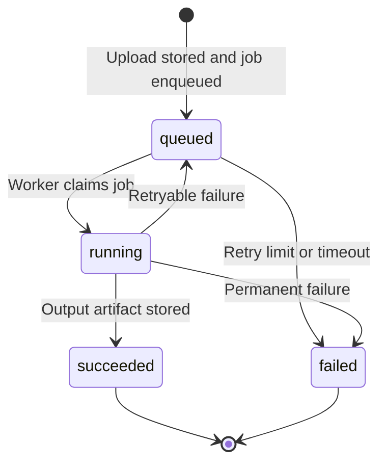
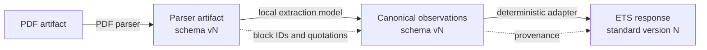

# BioParser architecture

## Purpose and scope

BioParser is a locally hosted service for extracting mammal traits from scientific
articles. Clients submit a digital born PDF and poll an asynchronous job. The article
is parsed into traceable content blocks, a local model extracts canonical observations,
and the API maps validated observations to Ecological Trait Data Standard (ETS) output.

The system must:

- run without external AI services
- keep every extracted observation traceable to its source
- avoid transporting large files through the job queue
- keep parsing, model inference, and ETS conversion independently replaceable
- run locally with Docker Compose and on OpenShift.

Scanned PDFs and OCR are not part of the initial proof of concept.

## System overview

Redis messages contain identifiers and artifact references, not PDF bytes or complete
model results. This keeps queue messages small and allows the storage implementation
to evolve separately.

## Components

### API

FastAPI owns the public HTTP contract:

- `POST /api/extractions` for PDF submission
- `GET /api/jobs/{job_id}` for job status and results
- `/health` for process liveness
- a readiness endpoint for Redis and artifact storage availability

It validates and stores uploads before enqueueing work. Parsing and inference never run
in the request process. A separate, versioned API module maps canonical observations to
ETS deterministically.

### Queue and storage

Redis carries job references, state, retries, and timeouts. It is not an artifact
archive. PDFs and versioned outputs live behind an artifact storage interface:

- a named volume in Docker Compose
- a shared persistent volume on OpenShift
- an S3 compatible backend such as MinIO if shared storage is unavailable

### Workers

The CPU oriented parser worker reads a PDF artifact, invokes the selected parser, stores
a validated parser artifact, and updates job state. It has no dependency on ETS or the
language model.

The independently deployable extractor worker consumes parser artifacts, runs the local
model, validates canonical observations, rejects candidates without evidence, and stores
the result. It may have separate memory and GPU requirements. Sprint 0 defines this
boundary and evaluates runtimes. Production inference comes later.

## Processing sequence

The parser only Sprint 0 path terminates successfully after storing the parser artifact.
The extractor and ETS steps are added without changing PDF submission or job polling.

## Job lifecycle

Workers tolerate duplicate delivery without corrupting completed jobs. Retries and
timeouts are bounded, and API errors do not expose secrets or stack traces.

## Data contracts and provenance

All stored structured artifacts have an explicit schema version.

### Parser artifact

A parser artifact contains the document ID and checksum, parser and schema versions,
and ordered content blocks. Each block has a stable ID, type, page number, text, and
source coordinates.

### Canonical extraction artifact

The model produces a standard independent candidate with taxon text, trait, value,
unit, biological qualifiers, statistical context, evidence block and quotation,
model/prompt versions, and validation status. Candidates without valid evidence are
not returned as verified observations.

### ETS response

The API adapter maps validated observations to an explicit ETS version. Keeping it
outside the model:

- prevents model retraining for ETS mapping changes
- makes mappings reviewable and testable
- allows other output standards to be added later
- distinguishes source supported values from normalized or derived fields

## Deployment

### Docker Compose

Docker Compose runs FastAPI, Redis, the parser worker, an optional extractor worker, and
shared artifact storage. Services use versioned images and environment configuration.
Model weights come from local infrastructure. Workers do not download from external AI
services at runtime.

### OpenShift

The API and workers are separate OpenShift workloads with independent scaling and
resource limits. Only workers that need a GPU are scheduled onto GPU nodes.
Configuration covers Redis, storage claims, secrets, liveness, and readiness. Shared
artifacts never rely on pod local storage.

## Cross cutting requirements

- Logs include relevant job, document, artifact, parser, model, and schema identifiers.
- File size, page count, processing time, and retry limits protect the service.
- Uploaded filenames are metadata only and are never used directly as storage paths.
- Configuration and errors do not expose secrets.
- Tests can replace Redis and storage with in memory or temporary implementations.
- Integration tests cover the real Redis and shared storage path.
- Production requires an artifact retention and deletion policy.

## Evolution points

Without changing the public job workflow, the system can replace parsers, storage, or
model runtimes. It can add OCR and table extraction, support domains such as diet, and
add new ETS versions or other output adapters.
